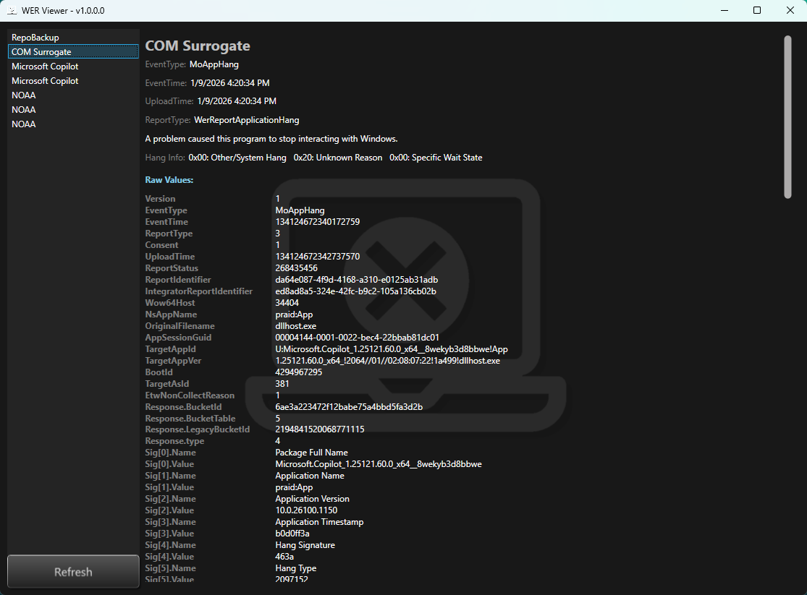



## WER Viewer - WPF

## v1.0.0.0 - January, 2026
**Dependencies**

| Assembly | Version |
| ---- | ---- |
| .NET Framework | 4.8 |

- A [WPF](https://learn.microsoft.com/en-us/dotnet/desktop/wpf) application that fetches the WER reports from Windows.
    - Specifically from the `Environment.SpecialFolder.CommonApplicationData`
- Don't forget to give a ⭐ if you find this repo helpful or informative.

